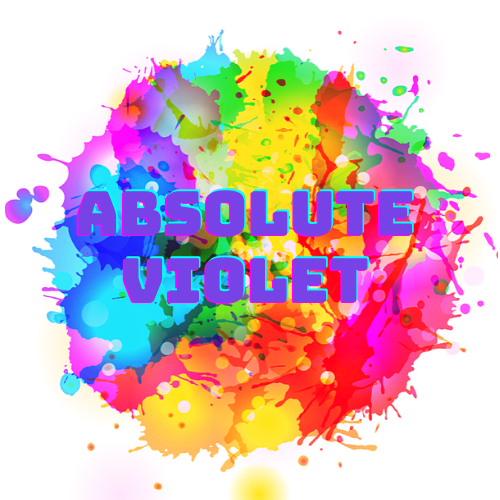

## Brought to you by
<p align="center"></p>

<p><a title="Try Absolute Violet" href="https://www.github.com/AntuHere/absolute-violet">Absolute Violet</a>
Official VS Code theme of Absoluet Violet!</p>

---

## Table of contents

If you are a big fan of **Absolute Violet** and you use Visual Studio Code as your code editor, this is the theme for you.

- [Brought to you by](#brought-to-you-by)
- [Table of contents](#table-of-contents)
- [Theme Screenshots](#theme-screenshots)
- [Getting started](#getting-started)
  - [Prerequisites](#prerequisites)
  - [Installation](#installation)
- [Activate theme](#activate-theme)
- [Recommended settings for a better experience](#recommended-settings-for-a-better-experience)

## Theme Screenshots

### Absolute Violet

<p align="center"></p>
<p align="center"></p>


## Getting started

You can install this awesome theme through the [Visual Studio Code Marketplace](https://marketplace.visualstudio.com/items?itemName=mdantu.absolute-violet-theme).

### Prerequisites

This theme is compatible for VS Code version 2.2.0+

### Installation

Launch _Quick Open_:

-  <a href="https://code.visualstudio.com/shortcuts/keyboard-shortcuts-linux.pdf">Linux</a> `Ctrl+P`
-  <a href="https://code.visualstudio.com/shortcuts/keyboard-shortcuts-macos.pdf">macOS</a> `⌘P`
-  <a href="https://code.visualstudio.com/shortcuts/keyboard-shortcuts-windows.pdf">Windows</a> `Ctrl+P`

Paste the following command and press `Enter`:

```shell
ext install mdantu.absolute-violet-theme
```

And pick the one by **Md Antu** as author.

## Activate theme

Launch _Quick Open_:

-  <a href="https://code.visualstudio.com/shortcuts/keyboard-shortcuts-linux.pdf">Linux</a> `Ctrl + Shift + P`
-  <a href="https://code.visualstudio.com/shortcuts/keyboard-shortcuts-macos.pdf">macOS</a> `⌘ + Shift + P`
-  <a href="https://code.visualstudio.com/shortcuts/keyboard-shortcuts-windows.pdf">Windows</a> `Ctrl + Shift + P`

Type `theme`, choose `Preferences: Color Theme`, and select Absolute Violet Theme from the list. After activation, the theme will be activated.

## Recommended settings for a better experience

```js
{
    // Controls the font family.
    "editor.fontFamily": "Operator Mono, Fira Code",
    // Enables font ligatures
    "editor.fontLigatures": true,
}
```

In case you don't see the terminal does not look as expected, you can make the below customization in your VS Code settings.json file

```js
{
  // controls the color of the terminal
  "workbench.colorCustomizations": {
    "terminal.ansiBlack": "#171c2a",
    "terminal.ansiRed": "#E35535",
    "terminal.ansiGreen": "#52AB62",
    "terminal.ansiYellow": "#ffd866",
    "terminal.ansiBlue": "#00B3BD",
    "terminal.ansiMagenta": "#e991e3",
    "terminal.ansiCyan": "#78e8c6",
    "terminal.ansiWhite": "#FFFFFFcc",
    "terminal.ansiBrightBlack": "#00B3BD",
    "terminal.ansiBrightRed": "#E35535",
    "terminal.ansiBrightGreen": "#52AB62",
    "terminal.ansiBrightYellow": "#ffd866",
    "terminal.ansiBrightBlue": "#00B3BD",
    "terminal.ansiBrightMagenta": "#e991e3",
    "terminal.ansiBrightCyan": "#78e8c6",
    "terminal.ansiBrightWhite": "#00B3BD",
    "terminal.background": "#171c2a",
    "terminalCursor.background": "#ffd866",
    "terminalCursor.foreground": "#ffd866"
  }
```

## Contributors 

Thanks goes to these wonderful people ([emoji key](https://allcontributors.org/docs/en/emoji-key)):

<!-- ALL-CONTRIBUTORS-LIST:START - Do not remove or modify this section -->
<!-- prettier-ignore-start -->
<!-- markdownlint-disable -->
<table>
  <tr>
    <td align="center"><a href="https://www.facebook.com/52HertzWhale.Toha"><br /><sub><b>Hasan Ibn Amir Toha (FC)</b></sub></a><br />🤔💻</td>
  </tr>
    </table>

---

<p align="center">Copyright &copy; 2021 MD Antu</p>
